# VotelySign

VotelySign adalah platform e-voting modern yang menggabungkan teknologi blockchain, kriptografi modern (Schnorr signature, Zero-Knowledge Proof), dan desain frontend interaktif untuk menghadirkan sistem pemilihan yang **aman, transparan, dan dapat diverifikasi**.

---

## ✨ Fitur Utama

- **Voting Aman & Terenkripsi**  
  Setiap suara dienkripsi dan ditandatangani secara digital menggunakan algoritma Schnorr Signature.
- **Verifikasi Blockchain**  
  Semua suara dicatat di blockchain (Ethereum Sepolia) untuk transparansi dan auditabilitas.
- **Zero-Knowledge Proof (ZKP)**  
  Menggunakan ZKP (Bulletproof) untuk membuktikan validitas suara tanpa membocorkan pilihan pemilih.
- **Live Count Real-Time**  
  Hasil pemilihan dapat dipantau secara real-time langsung dari blockchain.
- **Multi-Role**  
  Mendukung peran panitia (admin) dan pemilih dengan alur terpisah.
- **Audit Log**  
  Setiap aksi penting dicatat dan dapat diaudit dengan hash dan ZKP.
- **Antarmuka Modern**  
  UI/UX responsif berbasis Next.js, TailwindCSS, dan komponen custom.

---

## 🏗️ Arsitektur & Teknologi

- **Frontend:**  
  - Next.js (React)
  - TailwindCSS
  - Framer Motion (animasi)
  - ethers.js (integrasi blockchain)
- **Backend:**  
  - Node.js (API, server actions)
  - Drizzle ORM (PostgreSQL)
  - Custom cryptography (Schnorr, Bulletproof)
- **Blockchain:**  
  - Ethereum Sepolia Testnet
  - Smart Contract Solidity (Voting)
- **Database:**  
  - PostgreSQL (struktur tabel: elections, candidates, voters, vote_transactions, blocks, audit_logs, election_results)

---

## 🔒 Algoritma & Kriptografi

### 1. **Schnorr Signature**
- **Tujuan:**  
  Menandatangani data voting secara digital, membuktikan suara berasal dari pemilih sah tanpa membocorkan identitas.
- **Cara Kerja:**  
  - Pemilih memasukkan private key.
  - Data voting di-hash (SHA-256), lalu ditandatangani dengan Schnorr.
  - Signature diverifikasi di backend/blockchain.

### 2. **Zero-Knowledge Proof (snarkjs)**
- **Tujuan:**  
  Membuktikan suara valid (misal: memilih kandidat yang sah) tanpa membocorkan isi suara.
- **Cara Kerja:**  
  - ZKP dihasilkan menggunakan snarkjs untuk setiap transaksi voting.
  - Bukti ini disimpan di blockchain dan database.

### 3. **Merkle Tree & Block Hash**
- **Tujuan:**  
  Menjamin integritas blok dan transaksi voting.
- **Cara Kerja:**  
  - Setiap blok berisi hash Merkle root dari transaksi.
  - Block hash dihasilkan dari seluruh isi blok.

### 4. **Nullifier Hash**
- **Tujuan:**  
  Mencegah double voting tanpa mengaitkan identitas pemilih.
- **Cara Kerja:**  
  - Nullifier hash dihasilkan dari ID pemilih + private key.
  - Disimpan di database dan blockchain.

---

## 🗂️ Struktur Database

- **elections:** Info pemilihan (judul, deskripsi, waktu, kode, blockchain address, dsb)
- **candidates:** Data kandidat (nama, deskripsi, public key)
- **voters:** Data pemilih (kode akses, public key, nullifier, dsb)
- **vote_transactions:** Transaksi voting (hash, encrypted vote, signature, bulletproof, dsb)
- **blocks:** Blok blockchain internal (block hash, merkle root, dsb)
- **audit_logs:** Log audit (event hash, ZKP, metadata)
- **election_results:** Hasil akhir (vote count, tally proof)

---

## 🚦 Alur Kerja Sistem

### 1. **Panitia/Admin**
- Input data pemilihan & kandidat.
- Sistem generate kode pemilihan, kode pemilih, dan private key untuk tiap pemilih.
- Kode dibagikan ke pemilih.

### 2. **Pemilih**
- Input kode pemilihan & kode pemilih.
- Sistem verifikasi ke backend (hash & DB).
- Jika valid, pilih kandidat.
- Input private key → sistem generate signature & ZKP.
- Vote dikirim ke blockchain.
- Status pemilih diupdate (has_voted).

### 3. **Live Count**
- User input kode pemilihan.
- Frontend request hasil suara ke backend.
- Backend ambil data suara dari smart contract.
- Hasil suara ditampilkan secara real-time.

---

## 🗺️ Diagram Alur Sistem

### **Alur Panitia**

### **Alur Pemilih**

### **Sequence Diagram Voting**

```mermaid
sequenceDiagram
    participant Voter
    participant Backend
    participant Blockchain

    Voter->>Backend: Kirim kode pemilih, kode pemilihan
    Backend->>Backend: Verifikasi kode (hash)
    Backend-->>Voter: Status valid/tidak

    Voter->>Backend: Pilih kandidat, kirim private key
    Backend->>Backend: Generate signature (Schnorr)
    Note right of Backend: 🔒 Generate signature (Schnorr)
    Backend->>Backend: Generate ZKP (Zero-Knowledge Proof)
    Note right of Backend: 🕵️ Generate ZKP (Zero-Knowledge Proof)
    Backend->>Blockchain: Submit vote (dengan signature & ZKP)
    Note right of Blockchain: ⛓️ Simpan transaksi vote ke blockchain
    Blockchain-->>Backend: Hash transaksi
    Backend->>DB: Update status has_voted
    Backend-->>Voter: Konfirmasi sukses
```

### **Sequence Diagram Live Count**

---

## 🧑‍💻 Cara Kerja Voting (Ringkas)

1. Pemilih akses halaman voting, input kode pemilihan & kode pemilih.
2. Backend verifikasi kode, cek status voting.
3. Pemilih pilih kandidat, input private key.
4. Sistem generate signature & ZKP, kirim ke smart contract.
5. Blockchain mencatat suara, backend update status pemilih.
6. Hasil voting dapat dipantau real-time.

---

## 📚 Referensi & Sumber

- [Ethereum Sepolia Testnet](https://sepolia.etherscan.io/)
- [Schnorr Signature](https://en.wikipedia.org/wiki/Schnorr_signature)
- [Bulletproofs (ZKP)](https://crypto.stanford.edu/bulletproofs/)
- [Drizzle ORM](https://orm.drizzle.team/)
- [ethers.js](https://docs.ethers.org/)
- [Next.js](https://nextjs.org/)

---

## 📝 Catatan

- Untuk produksi, ZKP sudah menggunakan snarkjs.
- Private key harus dijaga kerahasiaannya oleh pemilih.

---

## 📧 Kontak & Kontribusi

- Email: [fadhilgani2@gmail.com](mailto:fadhilgani2@gmail.com)
- Pull request & issue sangat diterima!

---

**VotelySign** – Vote digitally, signed & secured by blockchain ⛓️🚀
